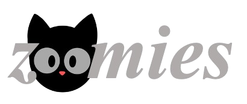

Welcome to the ``zoomies`` documentation!
==========================================

Stars get the zoomies too. ``zoomies`` is a kinematic age prediction package that uses Gaia parallax, proper motion, and radial velocity along with a Milky Way potential model to produce a stellar age prediction based on its galactic orbit.

For more detailed information, please see our paper: `Sagear et al. 2024 <https://iopscience.iop.org/article/10.3847/1538-4357/ad8b26>`_

Contents
--------

.. toctree::
   :titlesonly:
   :maxdepth: 1

   installation
   api
   cite

Tutorials
--------

.. toctree::
   :titlesonly:
   :maxdepth: 1
   
   tutorials/Main_Kinematic_Age_Spline
   tutorials/get_age_predictions

